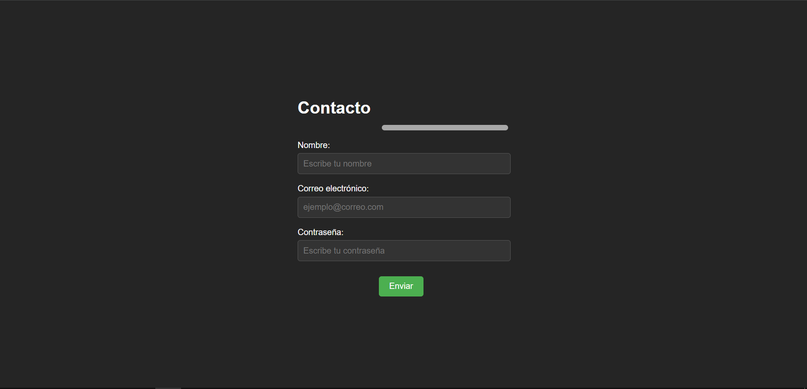

# Formulario de Contacto con Validación

Una aplicación web sencilla que implementa un **formulario de contacto** con validaciones en el lado del cliente usando **JavaScript**.  
Permite ingresar nombre, correo electrónico y contraseña, mostrando mensajes de error en caso de que los datos no cumplan con los requisitos.

# Decisiones de Diseño

## Interfaz Minimalista y Centrada
El formulario se presenta en el centro de la pantalla con un fondo oscuro y texto claro para mejorar la legibilidad y reducir distracciones.  
Se utilizó una paleta de colores simple que contrasta de forma agradable.

## Validación en Tiempo Real al Enviar
El código JavaScript valida la información ingresada antes de enviarla, mostrando mensajes de error personalizados y evitando el envío si existen datos inválidos.

## Uso de Flexbox para Centrado
La página utiliza **Flexbox** para centrar el formulario vertical y horizontalmente, asegurando que se vea bien en diferentes resoluciones.

# Desafíos Enfrentados y Soluciones Implementadas

## Validación de Nombre

**Desafío**: Asegurar que el nombre solo contenga letras y tenga una longitud entre 3 y 20 caracteres.

**Solución**: Se utilizó una expresión regular que acepta letras (incluyendo acentos), espacios y guiones.

---

## Validación de Correo Electrónico

**Desafío**: Garantizar que el correo electrónico tenga un formato válido.

**Solución**: Uso de una expresión regular estándar para validar direcciones de correo.

---

## Validación de Contraseña

**Desafío**: Exigir una contraseña segura con mínimo de 8 y máximo de 20 caracteres, incluyendo mayúsculas, minúsculas y números.

**Solución**:  
- Expresiones regulares para verificar cada requisito.  
- Mensajes de error específicos para cada incumplimiento.  

---

## Retroalimentación Visual

**Desafío**: Mostrar errores de forma clara sin recargar la interfaz.

**Solución**:  
- Mensajes de error en color rojo sobre el formulario.  
- Uso de `window.alert` al enviar correctamente el formulario.

# Conclusiones

Este formulario es seguro y fácil de usar. La validación previa evita errores comunes y mejora la experiencia del usuario. Además, el diseño centrado y minimalista hace que sea visualmente agradable y adaptable a cualquier dispositivo.

# Como usar la App

1. Descargar o clonar la carpeta del proyecto.
2. Abrir el archivo `index.html` en un navegador.
3. Completar el formulario y presionar **Enviar** para ver la validación en acción.
