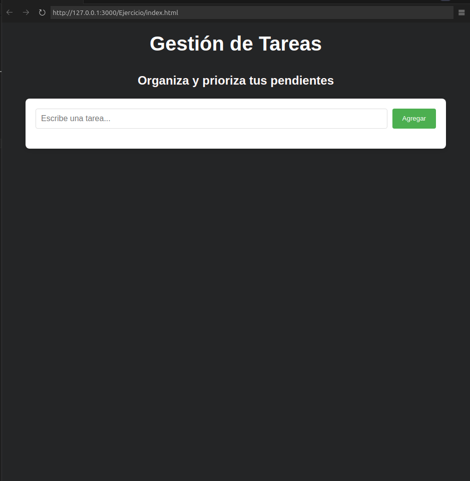
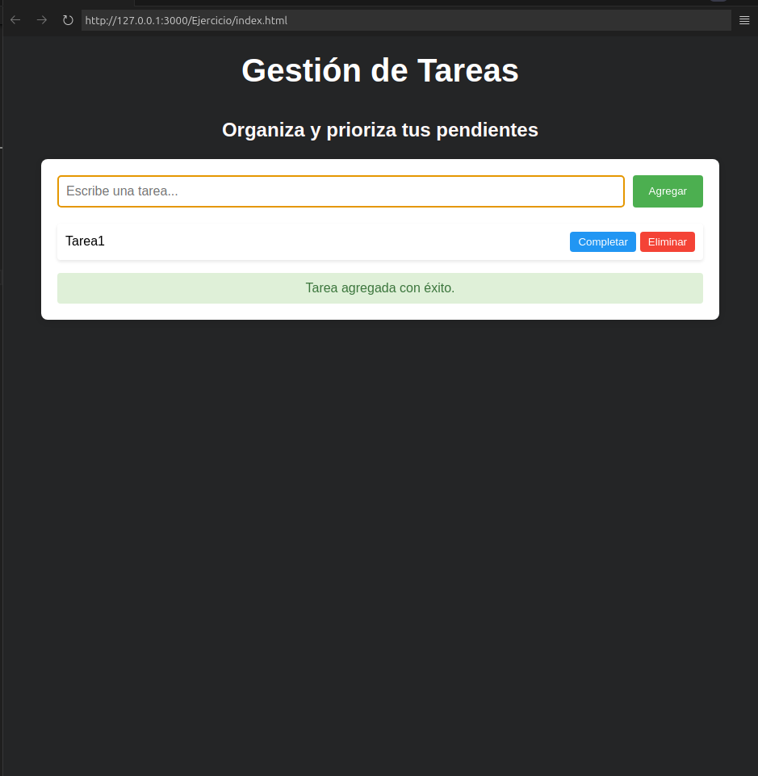

# Interfaz interactiva

Una aplicación web sencilla para gestionar tus tareas diarias. Permite agregar, completar y eliminar tareas, también ofrece retroalimentación para mejorar la experiencia del usuario.


# Decisiones de Diseño

## Interfaz Minimalista
Tiene un diseño limpio y simple para evitar distracciones y facilitar la interacción del usuario. Esto se reflejó en la paleta de colores (fondo oscuro con texto claro) que también ayuda a enfocar la atención en el contenido y las tareas.



## Uso de Flexbox
Para la disposición de los elementos, se empleó Flex. Esto garantiza que los componentes se adapten bien a diferentes tamaños de pantalla, proporcionando una experiencia móvil amigable.

## Retroalimentación Visual
Se incluyó un sistema de retroalimentaciión. Esto mejora la interacción y ayuda a prevenir errores o malentendidos.



# Desafíos Enfrentados y Soluciones Implementadas

## Validación de Tareas

**Desafío**: Asegurar que el usuario no agregue tareas vacías o duplicadas.

**Solución**: Se implementaron validaciones para evitar que se agreguen tareas vacías. Además, se comparan las tareas existentes con la nueva tarea antes de agregarla a la lista, asegurando que no haya duplicados.

## Interactividad con la Lista de Tareas

**Desafío**: Permitir que las tareas puedan ser marcadas como completas o eliminadas de forma dinámica.

**Solución**: Se añadieron botones interactivos para cada tarea, lo que permite marcar una tarea como completada o eliminarla. Para la tarea completada, se cambian los estilos (con una línea tachada y un cambio de color) para mejorar la visualización.

## Estilo y Accesibilidad

**Desafío**: Mantener una estética moderna y accesible, especialmente en dispositivos móviles.

**Solución**: Se utilizó un enfoque de diseño adaptativo con Flexbox, y se eligieron colores con suficiente contraste para garantizar que la aplicación sea accesible y legible en diferentes dispositivos.

# Conclusiones

La aplicación de gestión de tareas cumple con los objetivos de ser simple, funcional y fácil de usar. La retroalimentación visual y la validación de entrada son aspectos clave para mejorar la experiencia del usuario. Además, la aplicación está diseñada para ser fácilmente ampliable en el futuro, permitiendo agregar más funcionalidades si es necesario.

# Como usar la App

1. Descargar o clona la carpeta App
```bash
Projects/JavaScript/Tareas/App
```
o
```bash
git clonehttps://github.com/Carlos-alt-art/Projects/tree/1c760a19c109eb4ec790a0a57d14dabd8413dba4/Projects/JavaScript/Tareas/App
```

2. Abre el archivo index.html con un navegador
